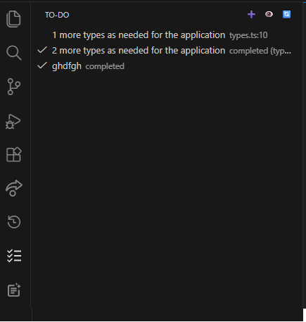

# To-Do Changelog Manager

A VS Code extension that helps you manage **to-do tasks** and **project changelogs** directly from dedicated side-panel views, keeping your development workflow organized and your release notes always up to date.

The extension provides **two visual interfaces**: one for managing To-Do items and another for building and maintaining a structured `CHANGELOG.md`.

---

## ✨ Features

### 📝 To-Do Manager View

Manage your development tasks without leaving VS Code:

* ➕ Add new to-do items
* ✏️ Edit existing tasks
* 🗑️ Delete tasks
* ✅ Mark tasks as completed
* 📌 Organize all tasks in a dedicated Tree View
* ⚡ Perform actions using **toolbar buttons and context menus**

---

### 📄 Changelog Manager View

Create and maintain changelogs visually and consistently:

* ➕ Add new versions
* 🧩 Add entries to predefined changelog sections:

  * Additions
  * Changes
  * Fixes
  * Deprecations
  * Removals
  * Security Changes
* ✏️ Edit or 🗑️ remove individual entries
* 🔄 Automatically keeps the **latest version at the top**
* 🧹 Omits empty sections for cleaner output
* 📁 Persists all changes directly into `CHANGELOG.md`

> The changelog interface and structure are **inspired by**
> [https://github.com/tobiaswaelde/vscode-simple-changelog](https://github.com/tobiaswaelde/vscode-simple-changelog)
> and implemented with custom logic and extended functionality.

---

## 🧭 User Interface

The extension adds **two sidebar views** to VS Code:

* **To-Do Manager**
* **Changelog Manager**

Each view includes:

* Toolbar buttons
* Context menu actions

No command-only workflow — everything is visual and intuitive.

---

## 🚀 Installation

1. Open **VS Code**
2. Go to **Extensions** (`Ctrl+Shift+X` / `Cmd+Shift+X`)
3. Search for **To-Do Changelog Manager** [To-Do Changelog Manager](https://marketplace.visualstudio.com/items?itemName=AntranixDEV.to-do-changelog-manager)
4. Click **Install**

---

## 🖼️ Screenshots

### To-Do Manager View

Manage your development tasks using an intuitive tree view with quick actions to add, edit, delete, and mark items as completed.

---

### Changelog Manager View

Create and maintain structured changelogs visually, keeping versions ordered and sections clean.

---

## 🛠️ Usage

### 📝 Task Management
- ➕ Add new tasks manually.
- ✏️ Edit existing tasks.
- ❌ Delete tasks you no longer need.
- ✅ Mark tasks as completed or uncompleted at any time.
- 🔄 Refresh tasks to update file links and task status.
- 👁️ Scan the entire workspace to automatically find TODO comments.

#### 🔍 Automatic TODO Detection
The extension scans your workspace and automatically detects TODO comments written in any of the following formats:

- `//TODO`
- `// TODO`
- `//TO-DO`
- `// TO-DO`

Detected TODOs are automatically converted into tasks.

#### 📎 File & Line Linking
- If a task comes from a source file, it is linked to:
  - The **file**
  - The **exact line number**
- Clicking the task opens the file directly at the corresponding line.

#### ✔️ Completing a TODO
When you mark a file-based TODO as completed:
- The TODO line is **removed from the source file**
- The task **remains stored** in the task list as completed (history is preserved)

#### ♻️ Restore a Completed TODO
- You can mark a completed task as **not completed**
- The TODO comment is **reinserted into the original file**
- The task returns to the active task list

#### 📂 Persistence
- Tasks are stored locally inside your workspace
- Completed tasks remain available as history
- A `to-do.md` file is automatically created in the project root
- By default, `to-do.md` is added to `.gitignore` to keep tasks local
- To enable Git synchronization, remove `to-do.md` from `.gitignore`

### Changelog Manager

* Open the **Changelog Manager** view
* Create new versions
* Add entries to specific sections
* Maintain a clean and structured `CHANGELOG.md`

All actions are available via toolbar buttons or right-click menus.

---

## 📦 Requirements

* Visual Studio Code **1.60+**

---

## License

[MIT](https://choosealicense.com/licenses/mit/)
